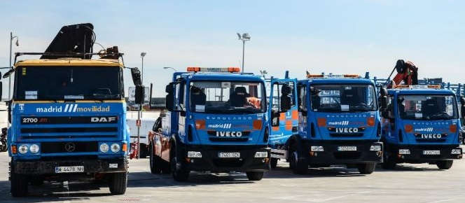

    

<small>Imagen descargada de este [enlace](https://blog.emtmadrid.es/2019/05/01/la-grua-en-madrid/).<small> 

# **ANÁLISIS DE LA RETIRADA DE VEHÍCULOS POR LA EMT EN MADRID (2016-2023): MOTIVOS Y MOMENTO DE LA RETIRADA Y TIEMPO EN EL DEPÓSITO**
 
> ## En este **análisis exploratorio de datos**, para el cual he utilizado **datos oficiales de la EMT**, trataré de investigar si **el tiempo** que pasan en los **depósitos municipales** los vehículos que son enviados a estos depende del **tipo de vehículo** (coche, moto, camión, etc.) del que se trate. También buscaré dar respuesta a la posible dependencia entre **el momento** (fin de semana o no, festivo o no, y hora del día) y el motivo por el que el vehículo fue retirado de la vía pública.
 

# **INTRODUCCIÓN**
> ## En la **introducción** de la presentación de este **EDA**, comenzaré presentando los datos y mostrando generalidades. El **objetivo** es destacar algunos **hechos históricos** relevantes, como el **confinamiento** de 2020, la **borrasca Filomena** que devastó Madrid en 2021, y un tema recurrente , **Madrid** en verano se queda **vacia**. Todo esto será respaldado por los **datos** proporcionados por la Empresa Municipal de Transportes de Madrid, S.A. (**"EMT"**). Sin embargo, no pretendo demostrar ni refutar **hipótesis** en esta etapa inicial.  
>>La Empresa Municipal de Transportes de Madrid (también conocida como EMT Madrid) es una empresa pública que, desde 1947, da servicio de transporte público de superficie en la ciudad de Madrid (España). Pertenece en su totalidad al ayuntamiento de esta ciudad.  
  
 
 

# **PRIMERA HIPÓTESIS**
> ## La primera hipótesis plantea que el motivo de retirada del vehículo y el momento en que este se retira de la vía pública, es decir, si es o no **fin de semana**, si es o no **festivo** o la **hora del día**, están relacionados entre sí. Es razonable suponer que algunos **motivos**, como por ejemplo la **alcoholemia**, serán más comunes a altas horas de la **madrugada** y en **fines de semana**, mientras que otros casos, como la retirada debido a trabajos de **poda de árboles** con **señalización**, serán más comunes durante **horarios laborales**. En esta parte del **análisis exploratorio de datos** (**EDA**), trataré de dar una respuesta objetiva a esta cuestión. 
 

# **SEGUNDA HIPÓTESIS** 
> ## La segunda hipótesis que intentaré demostrar es que el **tiempo**, medido en **días**, que un **vehículo** permanezca en el **depósito municipal** dependerá del **tipo de vehículo** del que se trate. Parto de una premisa sencilla: no es lo mismo que retiren un **camión**, que suele ser una herramienta de trabajo, que un **coche** por no tener la **ITV**. Es fácil pensar que el primero **saldrá rápidamente** del depósito, mientras que el segundo podría **permanecer mucho más tiempo** en el depósito. 
>>Es importante mencionar que no todos los vehículos que aparecen en el DataFrame que recoge la información sobre la retirada de vehículos aparecen en el DataFrame sobre la salida de los vehículos del depósito, puesto que aún no han salido. Además, aparecen algunos vehículos que no estaban en la tabla de retirada (de la vía pública), ya que habían entrado al depósito mucho antes, algunos incluso entraron en 1995, uno de ellos salió en 2023. Esto también se abordará en la introducción. 
  

# **FINAL**
> ## La presentación termina con un **gráfico de dispersión**, un **scatterplot**, en el que quedarán representadas las posiciones, usando las coordenadas, los distintos **depósitos**. El tamaño de los puntos representará el número de **vehículos** que, desde **2016 hasta 2023**, han pasado por cada uno de ellos. El fondo del gráfico será una **imagen georreferenciada** del mapa de Madrid. 
  

# **GRACIAS POR SU ATENCION.** 
