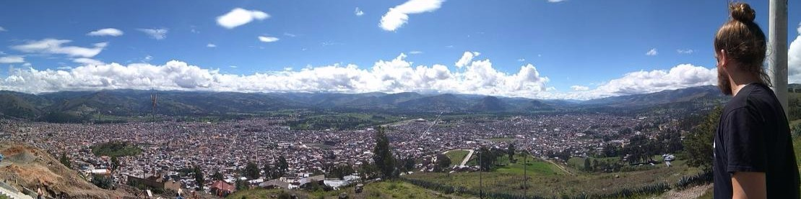

### **¿CUÁL ES EL PROPÓSITO DE ESTE REPOSITORIO?**
> Pues muy sencillo, me estoy reciclando y estoy cursando un bootcamp de ciencias de datos. El bootcamp es online y usamos GitHub para entregar nuestras prácticas.

>> He elegido esta foto, que fue tomada en Perú, porque supuso un cambio importante en mi vida, así como lo es realizar este bootcamp. Por cierto, es la misma foto que tengo como portada en LinkedIn.
Si quieres, [haz clic y podrás ver mi cuenta.](https://www.linkedin.com/in/pepereina/)

## OK, LO ENTIENDO... EN ESTE REPOSITORIO ENTREGARÁS TUS PRÁCTICAS... ¿PERO Y ESTE README?
>A preguntas tontas, respuestas simples: **PARA APRENDER MARKDOWN**<

